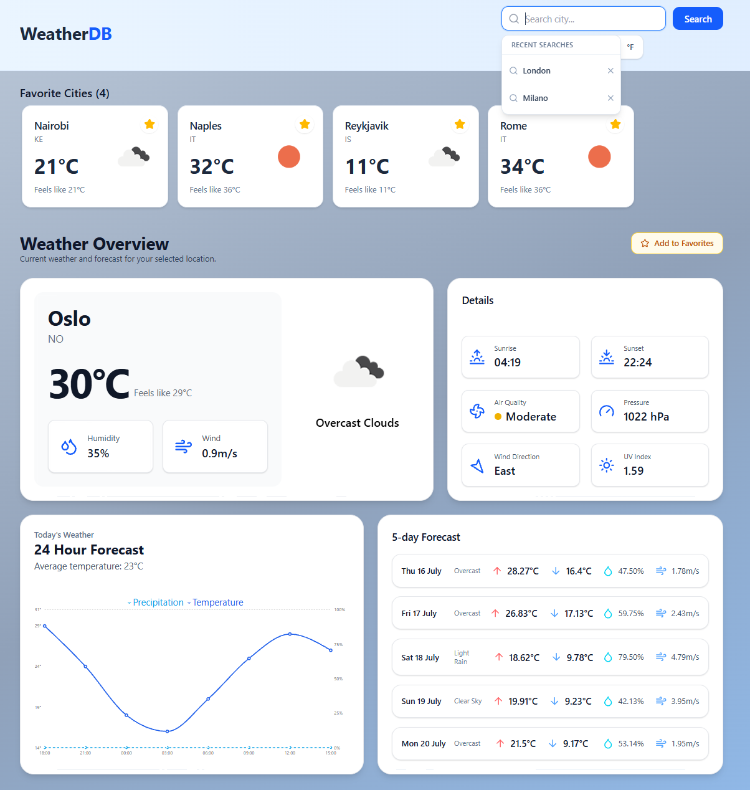
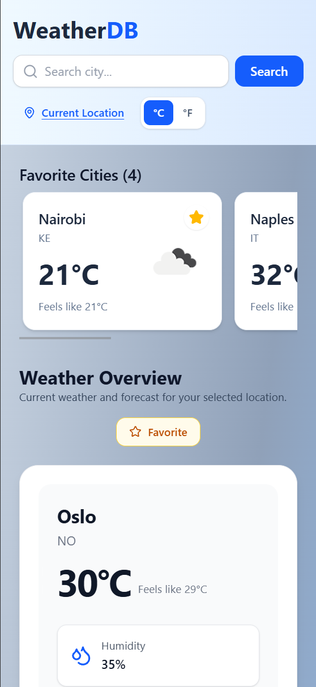

# WeatherDB

A modern, responsive weather dashboard built with **React**, **TypeScript**, and **Tailwind CSS** that delivers real-time weather data, interactive forecasts, air quality information, and favorite locations using the OpenWeather API.

Built as a portfolio project to strengthen my frontend development skills, with a focus on reusable components, responsive design, API integration, state management, and polished user experiences.

---

## 📸 Preview

### Desktop



### Mobile



## 🌍 Live Demo

🔗 https://weatherdb.vercel.app/

---

# ✨ Features

### 🌤 Current Weather

- Search cities or use current location (Geolocation API)
- Real-time temperature, "Feels Like", humidity, wind speed & direction
- Sunrise & Sunset times
- UV Index, Air Quality Index (with color coding), and Atmospheric Pressure

### 📈 Forecasts

- **24-hour** temperature and precipitation trend (interactive chart)
- **5-day** forecast with high/low temperatures
- Detailed daily weather cards
- Daily forecast cards with weather conditions, temperature, humidity, and wind speed

### ⭐ User Experience

- Save favorite cities (LocalStorage)
- Recent search history
- **Metric / Imperial** unit toggle (°C/°F)
- Fully responsive design
- Skeleton loaders and smooth animations (Framer Motion)
- **LocalStorage** (favorites, recent searches & unit preferences)

---

# 🛠 Built With

- **React** + **TypeScript**
- **Vite**
- **Tailwind CSS**
- **TanStack Query** (data fetching & caching)
- **Recharts** (charts)
- **Framer Motion** (animations)
- **Lucide React** (icons)
- **OpenWeather API**

---

# 🚀 Getting Started

## Clone the repository

```bash
git clone https://github.com/Tarp96/WeatherDashboard.git

cd WeatherDashboard
```

## Install dependencies

```bash
npm install
```

## Create a `.env` file in root directory

```env
VITE_API_KEY=your_openweather_api_key
```

You can obtain a free API key from the
[OpenWeather API](https://openweathermap.org/api).

## Start the development server

```bash
npm run dev
```

---

# 📁 Project Structure

```
src
│
├── assets
├── components
├── hooks
├── pages
├── services
├── types
├── utils
└── App.tsx
```

The project follows a modular structure where API calls, reusable UI components, utilities, and pages are separated to improve readability and maintainability.

---

# 💡 What I Learned

This project gave me the opportunity to work with several modern frontend technologies while focusing on writing maintainable and reusable code.

Some of the areas I particularly improved were:

- Structuring larger React applications
- Building reusable UI components
- Working with TypeScript interfaces and types
- Managing asynchronous API requests with TanStack Query
- Handling loading and error states gracefully
- Creating responsive layouts with Tailwind CSS
- Adding subtle animations with Framer Motion
- Persisting application state using LocalStorage
- Organizing application logic into reusable services and utility functions

---

# 🔮 Future Improvements

Although the application is feature complete, there are several ideas that could be explored in the future:

- Dark mode
- Weather alerts
- Interactive weather maps
- Multiple language support
- Progressive Web App (PWA)
- Search autocomplete
- Hourly forecasts beyond 24 hours

---

# 🌐 APIs

The project uses multiple endpoints from the OpenWeather platform.

- Geocoding API
- One Call API
- 5 Day / 3 Hour Forecast API
- Air Pollution API

---

# 🎯 Project Goal

The goal of WeatherDB was to build more than a simple weather application.

I wanted to create a polished frontend project that demonstrates modern React development, responsive UI design, third-party API integration, reusable components, and thoughtful user experience.

---

## 👤 Author

**Tarpinder Singh**

GitHub: https://github.com/Tarp96
